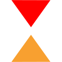

#  CueGen

[](https://github.com/mganss/CueGen/releases/latest)

Create Rekordbox cue points from Mixed in Key cue points or Rekordbox phrases.

## Features

- Create memory cues or hot cues
- Merge with existing cue points or overwrite
- Configure minimum distance in bars to existing cue points
- Configure maximum number of cue points to create
- Configure colors
- Assign colors based on energy level, phrase, or cue number
- Configure cue point names (comments)
- Set cue points only for specific tracks (based on name or creation date)
- All generated cue points can be removed
- Creates a database backup before each run (optional)
- Snap cue points to beat grid
- Add a new Rekordbox My Tag "Energy" with the track's energy level determined by Mixed in Key
- Set track color according to Energy level
- Optionally set intro and/or outro cue points to active loop

## Requirements

- Rekordbox 6
- Windows (open an issue if you're interested in a macOS version)
- Mixed in Key (phrase cue points work without Mixed in Key)

## Basics

CueGen operates directly on the Rekordbox database, there is no need to import/export tracks to/from XML.

Rekordbox needs to be shut down when CueGen runs. All tracks should already have been analyzed by Rekordbox to allow CueGen to snap cue points to the beginning of the bar.

In Mixed in Key you should have Serato integration checked on the settings page and have exported cue points (Click "Export cue points for existing files"). 
Serato integration writes cue points information to ID3 tags within the media files allowing CueGen to read it.

## Usage

CueGen is a console application (open an issue if you're interested in a GUI).

- Grab a .exe from https://github.com/mganss/CueGen/releases
- Unpack in location of your choice
- Open a command prompt and run the unpacked .exe with any of the options listed below

```
Usage: CueGen.Console [OPTION]...
Create Rekordbox cue points from MIK cue points.

Options:
  -h, --help                 Show this message and exit
      --dryrun               Do not alter Rekordbox database, only perform a
                               test run
      --hc, --hotcues        Create hot cue points instead of memory cue points
  -m, --merge                Merge with existing cue points (default is enabled)
  -d, --distance=VALUE       Minimum distance in bars to existing cue points (
                               default is 4)
      --colors=VALUE         Comma separated list of hot cue colors, same order
                               as in Rekordbox, top left is 1 (default is 1, 4,
                               6, 9, 12, 13, 14, 15)
  -x, --max=VALUE            Maximum number of cue points to create (default is
                               8)
      --comment=VALUE        Comment template, # will be replaced by energy
                               level (default is "Energy #")
  -g, --glob=VALUE           File glob of track file paths to include, e.g. C:\
                               Music\*.mp3 (default is all in Rekordbox
                               database)
  -r, --remove               Remove all cue points created through this program
  -b, --backup               Create database backup before creating cue points (
                               default is enabled)
  -s, --snap                 Snap cue points to nearest bar (default is enabled)
  -p, --phrase               Create cue points from phrases (default is
                               disabled)
      --my, --mytag          Create MyTag with energy level (default is
                               disabled)
  -e, --energy               Set track color according to energy level (default
                               is disabled)
      --energycolor          Set cue point color according to cue point's
                               energy level (default is enabled)
      --phrasecolor          Set cue point color according to cue point's
                               phrase (default is enabled)
      --progress             Report progress (default is enabled)
      --db, --database=VALUE File path to Rekordbox database (default is
                               autodetect)
  -v, --verbosity=VALUE      Verbosity level (default is warn, possible values
                               are off, fatal, error, warn, info, debug, trace)
  -l, --log=VALUE            File path to write log file to
  -n, --names=VALUE          Phrase names, comma separated (default are Intro,
                               Verse,Bridge,Chorus,Outro,Up,Down)
  -o, --order=VALUE          Phrase group order, comma separated groups of
                               slash separated phrase names (default is Intro,
                               Outro,Verse,Chorus,Bridge,Up/Down)
      --phraselength=VALUE   Minimum length of phrase group in bars (default is
                               4)
      --mindate=VALUE        Minimum creation date of tracks (default is any,
                               format is 2021-12-32T23:31:00, time is optional)
      --li, --loopintro=VALUE
                             Length in beats of active loop intro (default is
                               disabled)
      --lo, --loopoutro=VALUE
                             Length in beats of active loop outro (default is
                               disabled)
```

## Database Backup

CueGen automatically creates a backup of the Rekordbox SQLite database `master.db` in the Rekordbox folder `%AppData%\Pioneer\rekordbox`.
The backup files will have a datetime suffix, e.g. `master.backup.2021-04-04-13-40-05.db`.
If you want to restore one of these backups, replace the `master.db` file with a backup file.

## Mixed in Key cue points

Mixed in Key detects up to 8 cue points for each track. Each of the cue points gets assigned an energy level (in addition to the overall track energy level).
CueGen uses the energy level information to assign a cue point name (such as "Energy 6") and color.

## Phrase cue points

Cue points can also be created based on phrase information as analyzed by Rekordbox. For example, you can automatically set cue points where the outro starts and
whenever a chorus starts.

Rekordbox assigns phrases according to a "mood" it detects. The mood can be low, mid, or high. For each mood the following phrases exist:

- Low, Mid: Intro, Verse 1-6, Bridge, Chorus, Outro
- High: Intro 1-2, Up 1-3, Down, Chorus 1-2, Outro 1-2

CueGen creates cue points whenever a new phrase group starts. A phrase group is a number of consecutive phrases that start with the same but may have different numbers
(such as "Verse 1, Verse 2, Verse 3"). Additionally, you can combine phrase groups: For example, if you combine Down and Outro into a phrase group a cue point will be
created at the start of a sequence of phrases labeled Down or Outro.

## Cue point selection

If the number of cue points that would be generated though either Mixed in Key or phrases exceeds the maximum number of available cue point slots, 
cue points are created alternatingly at the start and end (first, last, second, next to last, etc).

## Colors

There are different types of colors in Rekordbox for memory cues and hot cues. 
Memory cues can have one of 8 eight different colors: Pink, Red, Orange, Yellow, Green, Aqua, Blue, and Purple.

Hot cues can technically have any color from 64 color palette, of which only 16 are surfaced in Rekordbox.

Mixed in Key cue points are by default assigned a color according to their energy level. For memory cue points purple is Energy 1 and pink is Energy 8.
Hot cues get similar colors picked from the 16 colors palette.

Phrase cue points by default get a color that is similar to the phrase group in Rekordbox (intro is red, chorus is green, etc).

Through the `--colors` command line option you can choose the palette of 8 colors that are used to map energy level, phrase, or cue point number.

## My Tag Energy

Although you can't manually create new My Tag categories through Rekordbox, its database schema allows for additional ones. 
CueGen can generate an Energy My Tag category from the energy level detected by Mixed in Key.

## Active Loops

CueGen can create active loops of configurable length for the first and last cue points.

## Thanks

- The [Deep Symmetry](https://github.com/Deep-Symmetry) project for information about Rekordbox analysis files 
- https://github.com/Holzhaus/serato-tags for information about Serato ID3 tags
